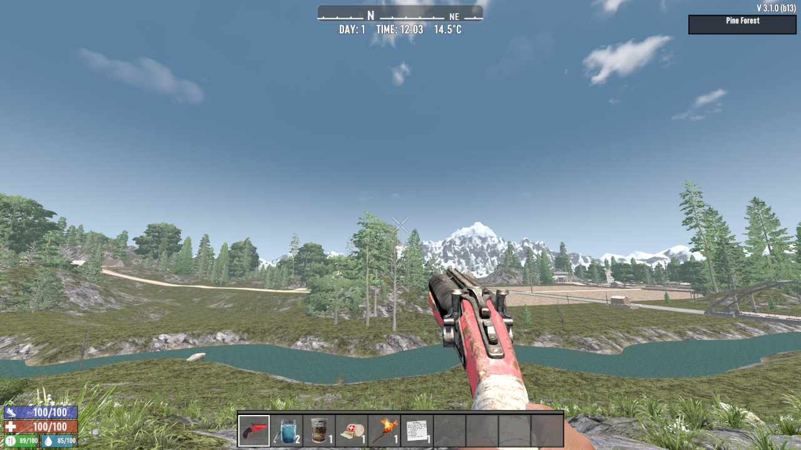

# Call AirDrop

A mod for 7 Days to Die.

This mod adds the Supply Signal Pistol (One-time use item), allowing you to call in a supply airdrop instantly at any time.

You will automatically receive one in your inventory when starting a new game, and it also has a low chance to spawn in fire trucks, military trucks, and some ammo piles.

_Bug Fix & Customization:_

- Fixes the vanilla bug where supply drops could spawn up to 1450m away from the player.
- The drop distance (min/max range) can be fully customized via the config.json file inside the mod folder.
- You can also adjust the airdrop's descent speed by changing the "AirDropAirBrakeFactor" value. Smaller values (e.g., current setting: 0.8) will make the crate fall faster. For reference, the vanilla default value is 0.95.

